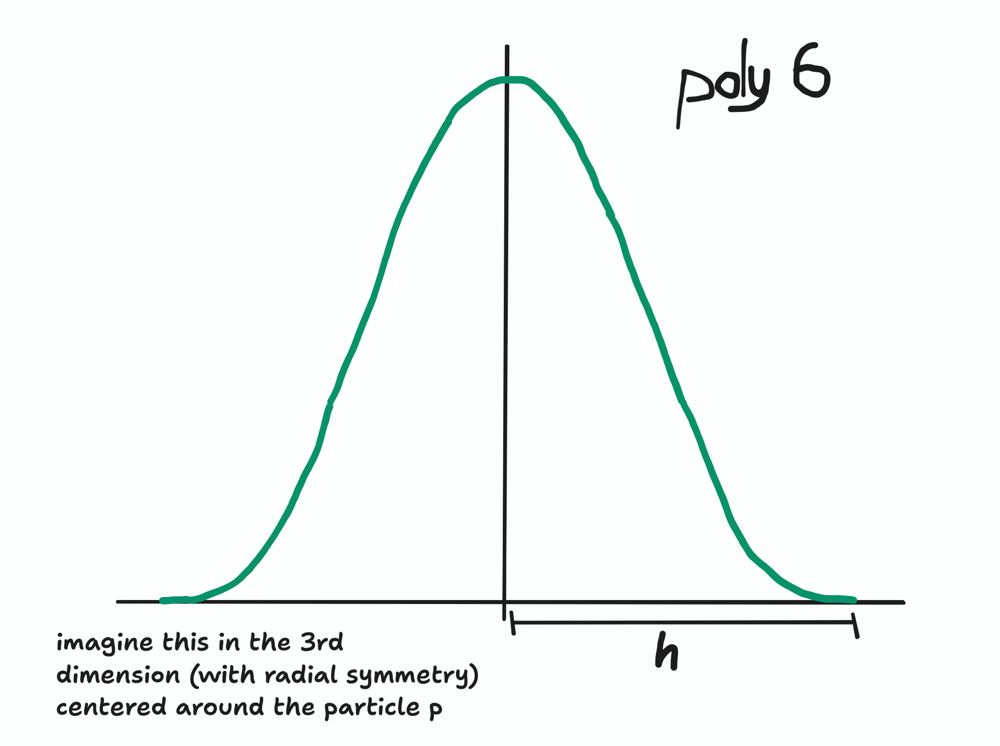

The following are what I consider the 8 important equations compiled from "Position Based Fluids" by Miles Macklin and Matthias Müller, 2013 (viewable [here](https://mmacklin.com/pbf_sig_preprint.pdf)). You should read that paper before reading this, if only to get a high level understanding of what we're doing, but also to try and understand the equations yourself first.

$$
\begin{align}
C_i(\mathbf p_1, ..., \mathbf p_n) = \frac{1}{\rho_0}\sum_jW(\mathbf p_i - \mathbf p_j) - 1 \tag 1
\end{align}
$$

$$
\begin{align}
\nabla_{\mathbf p_k}C_i = \frac{1}{\rho_0} \begin{cases}
\sum_j \nabla_{\mathbf p_k}W(\mathbf p_i - \mathbf p_j)& \text{if }k=i\\
-\nabla_{\mathbf p_k}W(\mathbf p_i - \mathbf p_j) & \text{if }k=j
\end{cases}
\end{align} \tag 2
$$

$$
\begin{align}
\lambda_i = -\frac{C_i(\mathbf p_1, ..., \mathbf p_n)}{\sum_k \left\vert \nabla_{\mathbf p_k}C_i\right\vert^2 + \epsilon}
\end{align} \tag 3
$$

$$
\begin{align}
s_\text{corr} = -k\left(\frac{W(\mathbf p_i - \mathbf p_j)}{W(\Delta \mathbf q)}\right)^n
\end{align} \tag 4
$$

$$
\begin{align}
\Delta \mathbf p_i = \frac{1}{\rho_0} \sum_j(\lambda_i + \lambda_j + s_\text{corr})\nabla W(\mathbf p_i - \mathbf p_j)
\end{align} \tag 5
$$

$$
\begin{align}
\omega_i = \sum_j \mathbf v_{ij} \times \nabla_{\mathbf p_j}W(\mathbf p_i - \mathbf p_j) \text{ where } \mathbf v_{ij} = \mathbf v_j - \mathbf v_i
\end{align} \tag 6
$$

$$
\begin{align}
\mathbf f_i^\text{vorticity} = \epsilon\left(\mathbf N \times \omega_i\right) \text{ where } \mathbf N = \frac{\eta}{\vert \eta \vert} \text{ and } \eta = \nabla\vert\omega\vert_i
\end{align} \tag 7
$$

$$
\begin{align}
\mathbf v_i^\text{new} = \mathbf v_i + c\sum_j \mathbf v_{ij} \cdot W(\mathbf p_i - \mathbf p_j)
\end{align} \tag 8
$$

## Explaining (1), (3) and (5)

$C_i$ is the constraint on the $i$th particle in the simulation. The goal first and foremost in creating a fluid is making it _incompressible_. The density of e.g. water doesn't change (if you were to try "stretch" it it would split into 2 or more blobs, if you tried to "squish" it it would escape however it can, be it leaking through small holes or using the force you're applying to break through walls. Water only actually compresses under really high loads which we're not interested in simulating here). Thus, this is what the constraint (1) enforces; that the particle should remain at the rest density $\rho_0$ (the constraint is satisfied when it $= 0$). The density at the particle's position is estimated by seeing how close the neighbouring particles are, which is we do by summing over the kernel function $W$ being applied to $\mathbf p_i - \mathbf p_j$, where $\mathbf p_j$ is the $j$th neighbouring particle to $\mathbf p_i$. All $W$ take the distance between $\mathbf p_i$ and $\mathbf p_j$— $r = \left\Vert\mathbf p_i - \mathbf p_j\right\Vert$ and apply something like a Gaussian distribution, simply saying that closer particles means more density. We could choose anything for this and the choice affects the behaviour of the fluid. "Poly6" will be the star of the show here; $W^\text{poly6} = \frac{315}{64\pi h^9}\left(h^2 - r^2\right)^3$ for being fast to compute and well-behaving.

Anyways, the goal is to find a $\Delta \mathbf p$ such that

$$
C(\mathbf p + \Delta \mathbf p) = 0
$$

. This is trying to find the roots of the function, which is a famously nontrivial problem to solve, and so as part of the the "position-based dynamics method," we use a linear approximation of our function. In the general case, this takes the form of the following, where $x_0$ is the point around which we're taking the linear approximation:

$$
L_f(x) = f(x_0) + f'(x_0) \cdot (x-x_0)
$$

It's not too hard to see that this is a line with some y-intercept and slope $f'(x_0)$, and then that $L_f(x_0) = f(x_0)$, which can be enough to convince us that this is indeed the tangent line at point $x_0$. For higher dimensions, the equation of the tangent _plane_ is something like this (for the example of 3 dimensions):

$$
L_f(x, y) = f(x_0, y_0) + \nabla_x f(x_0) \cdot (x-x_0) + \nabla_yf(y_0) \cdot (y - y_0)
$$

Again, you can verify that this does makes sense; it's clearly still linear, and the slope along each axis is as we'd want it. We can now step this up to the general multi-dimensional case as follows:

$$
L_f(\mathbf x) = f(\mathbf x_0) + \nabla f^T(\mathbf x - \mathbf x_0)
$$

Where $\nabla f$ is the gradient of $f$ and we're performing a dot product. Now, back to the problem at hand, the linear approximation of $C(\mathbf p + \Delta \mathbf p)$ at point $\mathbf p$ is

$$
\begin{align}
C(\mathbf p + \Delta \mathbf p) &\approx C(\mathbf p) + \nabla C^T (\mathbf p + \Delta \mathbf p - \mathbf p) \\
&\approx C(\mathbf p) + \nabla C^T \Delta \mathbf p
\end{align}
$$

From here, it looks like it'd be pretty simple to solve for $\Delta \mathbf p$:

$$
\begin{align}
C(\mathbf p) + \nabla C^T \Delta \mathbf p = 0 \\
&\\
\Delta \mathbf p = -\frac{C(\mathbf p)}{\nabla C^T}
\end{align}
$$

In fact, this looks exactly like _Newton's method_, an iterative algorithm for finding a root of any (derivable) function:

$$
x_{n+1} = x_n - \frac{f(x_n)}{f'(x_n)}
$$

And that makes a lot of sense if you think about what we did; get the tangent line (plane) at a point on the function and solve for when _that_ $= 0$ instead.

However, look at what happens when you step this up a dimension:

There in an entire _line_ of points which solves the tangent plane, and it's ambiguous which specific point we should choose. $-\frac{C(\mathbf p)}{\nabla C^T}$ doesn't make much sense as a thing to exist, and we can't divide by a vector like this. It's more clear when you un-vectorize it (like I showed for $L_f(x, y)$ above) that there's 2 (or more) unknowns, 1 equation.
Rather, what the paper does next is say that $\Delta \mathbf p$ will lie on some point of the line spanned by the vector $\nabla C(\mathbf p)$, the direction of steepest ascent/descent for our point:

$$
\Delta \mathbf p \approx \nabla C(\mathbf p)\lambda
$$

Now, $\lambda$ is the _constant_ we need to find, instead of finding the vector $\Delta \mathbf p$ (which we couldn't do). Substituting it in,

$$
C(\mathbf p + \Delta \mathbf p) \approx C(\mathbf p) + \nabla C^T \nabla C \lambda = 0
$$

. $\nabla C^T \nabla C$ is a dot product, and thus a constant which we can divide out, solving for $\lambda$:

$$
\lambda = -\frac{C(\mathbf p)}{\nabla C^T \nabla C}
$$

Un-vectorizing this as we see in Equation (3) gives

$$
\lambda_i = -\frac{C_i(\mathbf p_1, \dots, \mathbf p_n)}{\sum_k \left\vert\nabla_{\mathbf p_k}C_i \right\vert^2}
$$

, which might surprise you. A summation through $k$ is a summation through all particles $\mathbf p_j$ neighbouring $\mathbf p_i$, with the inclusion of $\mathbf p_i$ itself. And so, what the denominator implies is that $\nabla C$, the gradient of $C$, is a vector of dimensionality $n$, containing the partial derivatives $\nabla_{\mathbf p_k} C_i$. But notice that $\nabla_{\mathbf p_k} C_i$ is itself a (3D or 2D, depending on what we choose) vector! The squares of these vectors is taken to be dot products with themselves, expressed as $\vert\dots\vert^2$, making for constants that play nice with defining $\lambda_i$. This does make some basic level of sense; the constraint $C_i$ is a function of $\mathbf p_i$ _and_ its neighbours (altogether referred to as $\mathbf p_1, \dots, \mathbf p_n$), so this is what the gradient is. However, we could have just as easily said that the constraint is only a function of $\mathbf p_i$, and treat all the neighbouring particles' positions as constants. With how we did do things, we must imagine $\Delta \mathbf p$ as taking a step in some very high-dimensional parameter space, adjusting both the particle's position _and the positions of its neighbours_ the smallest possible amount that satisfies the constraint (approximately, we're working with linear approximations). Before continuing with that though, I want to recognize that we just engaged in some black magic; $\nabla C$ is a vector of vectors. To justify this, note that we could've flattened $\nabla C$ to have dimensionality $3n$ or $2n$ and actually, because we were just taking dot products, nothing changes; it's still the same sum of squared terms. Really, this is what we should've made explicit from the start (e.g. saying $C_i(\mathbf p_1^{(x)}, \mathbf p_1^{(y)}, \dots, \mathbf p_n^{(x)}, \mathbf p_n^{(y)})$ in Equation (1), and so on), and only later make this "factorization." Now, we will continue our interpretation of $\Delta \mathbf p$.

$\lambda$ Is a constant specifically tailored for $\nabla C(\mathbf p)$, to adjust the particle and all neighbouring particles in order to satisfy the constraint. So, when we use it in Equation (5) like this;

$$
\Delta \mathbf p_i = \nabla_{\mathbf p_i}C_i(\mathbf p_1, \dots, \mathbf p_n)\lambda_i
$$

we are doing something quite clever. We are only using the partial derivative with respect to $\mathbf p_i$, meaning we're only adjusting the particle and _assuming_ the neighbours will move similarly to how the full $\nabla C$ gradient wanted them to move. We don't fully make this assumption though because, as you can see in the real Equation (5), we are also utilizing the lambda values of the neighbours, $\lambda_j$. Just to explain, $\nabla_{\mathbf p_i}C_i = \frac1{\rho_0}\sum_j\nabla_{\mathbf p_i} W(\mathbf p_i - \mathbf p_j)$, and so what we're seeing in Equation 5 (ignoring $s_\text{corr}$ for now) rearranged is:

$$
\Delta \mathbf p_i = \frac1{\rho_0}\lambda_i\sum_j\nabla_{\mathbf p_i}W(\mathbf p_i - \mathbf p_j) + \frac1{\rho_0}\sum_j\lambda_j\nabla_{\mathbf p_i}W(\mathbf p_i - \mathbf p_j)
$$

Where the first term of the RHS is everything we would expect from $\Delta \mathbf p \approx \nabla C(\mathbf p)\lambda$, the second term is "extra." The way to make sense of this is that, just as how a particle has all the ways it wants to move its neighbours, all its neighbours also have their way of wanting to move the particle! If we want our full $\nabla C$ gradient to have a say in the adjustments of the neighbour particles, then what that means symmetrically is we need the neighbours to have a say in this adjustment. We can calculate the adjustment any particle $\mathbf p_j$ wants exactly as follows:

$$
\lambda_j \nabla_{\mathbf p_i}C_j = \frac1{\rho_0}\nabla_{\mathbf p_i}W(\mathbf p_j - \mathbf p_i)\lambda_j
$$

This follows from $\Delta \mathbf p \approx \nabla C(\mathbf p)\lambda$, only using the partial derivative with respect to $\mathbf p_i$ (this time as a neighbour to $\mathbf p_j$). Applying a summation of all $\mathbf p_j$ we get

$$
\frac1{\rho_0} \sum_j\lambda_j\nabla_{\mathbf p_i}W(\mathbf p_j - \mathbf p_i)
$$

, which is very similar to the second term of the actual $\Delta \mathbf p_i$, but with a key difference in the order of the terms in $\nabla W$. While this doesn't matter for the kernel function, it does for its derivative, which would be something like this:

$$
W(\mathbf x) = W^\text{poly6}(r) \text{ where }r=\Vert\mathbf x\Vert
$$

$$
W'(\mathbf x) = \frac{\mathbf x}{\Vert\mathbf x\Vert}{W^{\text{poly6}}}'(r)
$$

And so the difference between $\nabla_{\mathbf p_i}W(\mathbf p_i - \mathbf p_j)$ and $\nabla_{\mathbf p_i}W(\mathbf p_j - \mathbf p_i)$ is a multiplication by $-1$. Why do we switch the order back to $\mathbf p_i - \mathbf p_j$? Note that the $-1$ really matters to the derivative for making a particle and its neighbours opposites. Switching from viewing $\mathbf p_i$ as a neighbour in $\nabla_{\mathbf p_i}C_j$ to viewing it as _the_ particle to update means multiplying by $-1$. Another way to look at it,

$$
\frac\partial{\partial \mathbf b}\Vert\mathbf a - \mathbf b\Vert = -\frac{\mathbf a - \mathbf b}{\Vert\mathbf a - \mathbf b\Vert} = \frac{\mathbf b - \mathbf a}{\Vert\mathbf a - \mathbf b\Vert}
$$

is a vector of magnitude $1$ pointing away from $\mathbf a$ in the direction of $\mathbf b$. All that matters to $\nabla W$ is that the vector points away from the particle we're not in respect to, and we're not adjusting $-\mathbf p_i$ so that $C_j = 0$, rather, we're adjusting $\mathbf p_i$ so that $C_j = 0$. With that, we can put together the final $\Delta \mathbf p$ equation:

$$
\begin{align}
\Delta \mathbf p_i &= \frac1{\rho_0}\lambda_i\sum_j\nabla_{\mathbf p_i}W(\mathbf p_i - \mathbf p_j) + \frac1{\rho_0}\sum_j\lambda_j\nabla_{\mathbf p_i}W(\mathbf p_i - \mathbf p_j)\\
&=\frac1{\rho_0}\sum_j(\lambda_i + \lambda_j)\nabla W(\mathbf p_i - \mathbf p_j)
\end{align}
$$

This concludes the explanation of the core mathematics behind the Position Based Fluids method. By simplifying the problem to a solution of the linear approximation (and ultimately running for multiple solver iterations, much like Newton's method), the update rule works by adjusting particle positions under the assumption that its neighbours will make equal(ly important) steps in satisfying the constraint, while also weighing in in said neighbours' updates so that this does happen. All in the name of maintaining consistent density.
Following are the smaller details and extra considerations found in the paper.

## Explaining (2)

The partial derivative of $C_i$ with respect to $\mathbf p_k$. There are two cases on if $\mathbf p_k$ is _the_ particle $\mathbf p_i$, or one of its neighbours; $\mathbf p_j$. If it's one of the neighbours then all other terms of the summation are constants which we ignore, and also you can clearly see from the chain rule that $\nabla_{\mathbf p_i}W = -\nabla_{\mathbf p_j}W$ which is presumably why we see the minus sign below (although it doesn't make much sense; that's already included in the $\nabla_{\mathbf p_j}W$! Perhaps it was meant to both be partial derivatives with respect to $\mathbf p_i$ of the kernel function, rather than the $\mathbf p_k$ we see here).

$$
\begin{align}
\nabla_{\mathbf p_k}C_i = \frac{1}{\rho_0} \begin{cases}
\sum_j \nabla_{\mathbf p_k}W(\mathbf p_i - \mathbf p_j)& \text{if }k=i\\
-\nabla_{\mathbf p_k}W(\mathbf p_i - \mathbf p_j) & \text{if }k=j
\end{cases}
\end{align} \tag 2
$$

## Explaining (4)

\[TBC\]

## Appendices

### Appendix I: Derivative of Magnitude of Difference of Two Vectors

$$
\begin{align}
\frac\partial{\partial \vec a} \Vert \vec a-\vec b\Vert &= \frac\partial{\partial\vec a}\sqrt{\left(a_x - b_x\right)^2 + \left(a_y - b_y\right)^2}\\
&= \frac12\Big(\dots\Big)^{-\frac12}\left(\frac\partial{\partial\vec a}(a_x - b_x)^2 + \frac\partial{\partial\vec a}(a_y - b_y)^2\right) \\
&= \frac12\Big(\dots\Big)^{-\frac12}\left(2(a_x-b_x)\left(\hat i\right) + 2(a_y - b_y)\left(\hat j\right)\right) \\
&= \frac{\hat i(a_x - b_x) + \hat j(a_y - b_y)}{\sqrt{(a_x - b_x)^2 + (a_y - b_y)^2}}\\
&\\
&= \frac{\vec a - \vec b}{\Vert \vec a - \vec b\Vert}
\end{align}
$$
